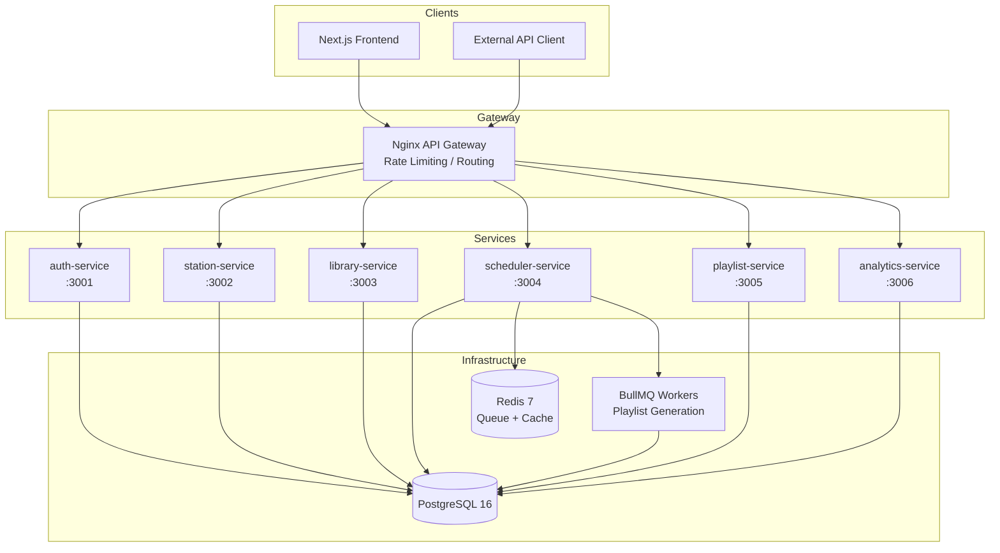
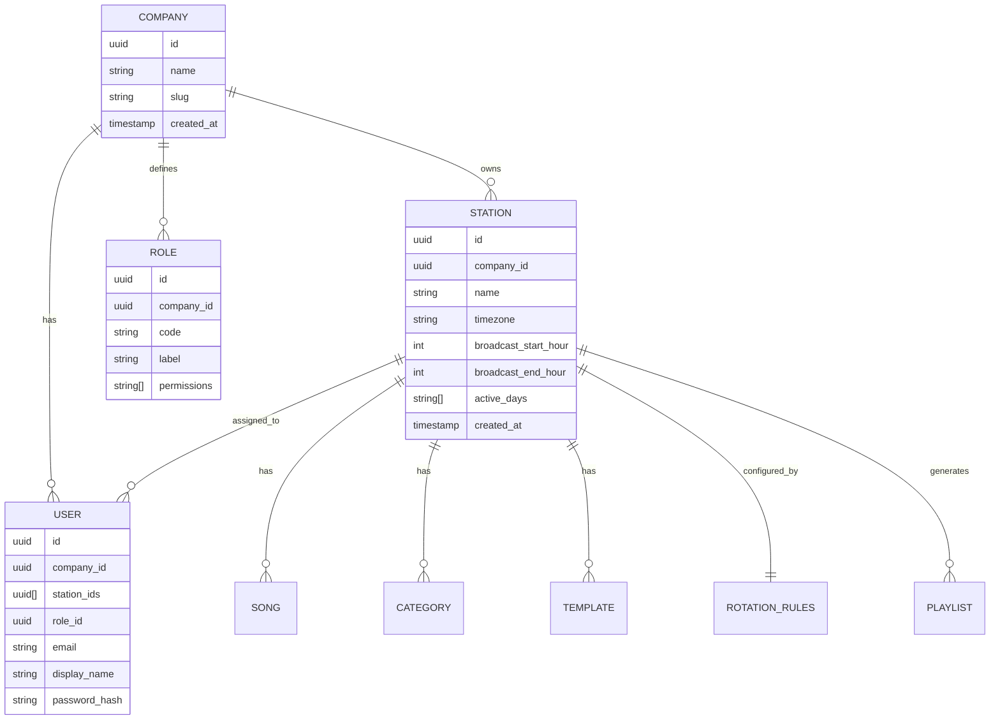
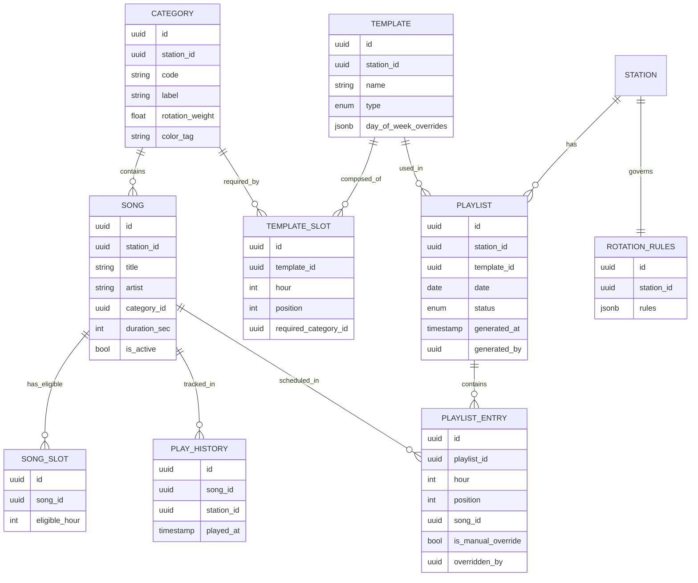
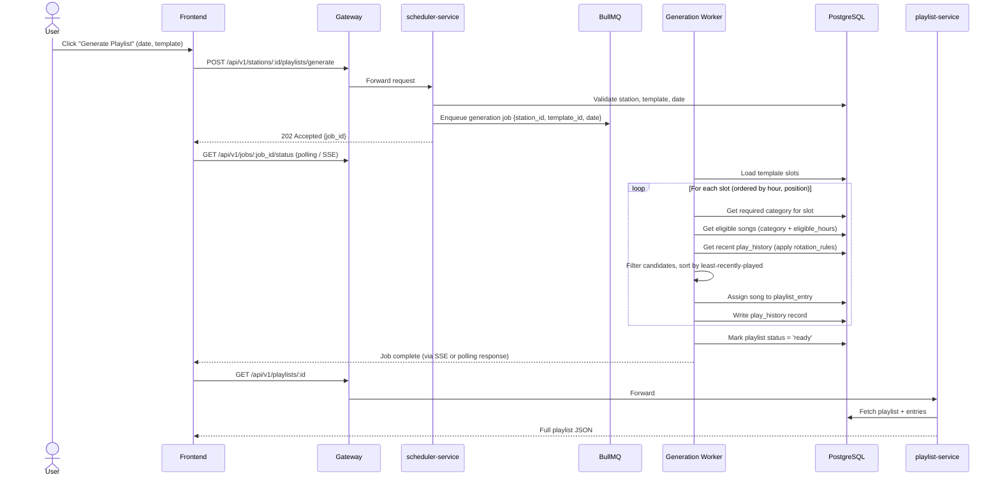
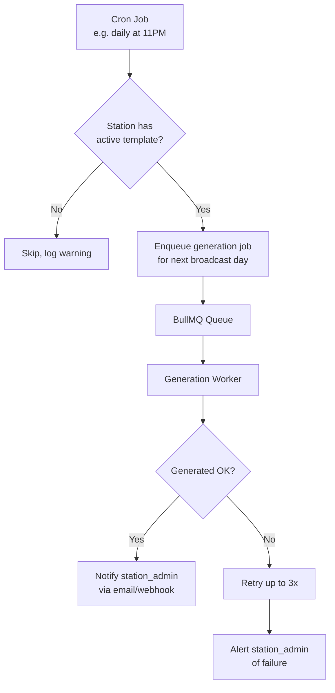
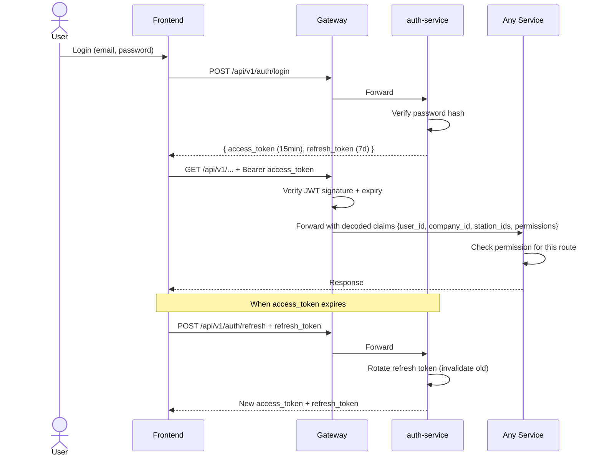
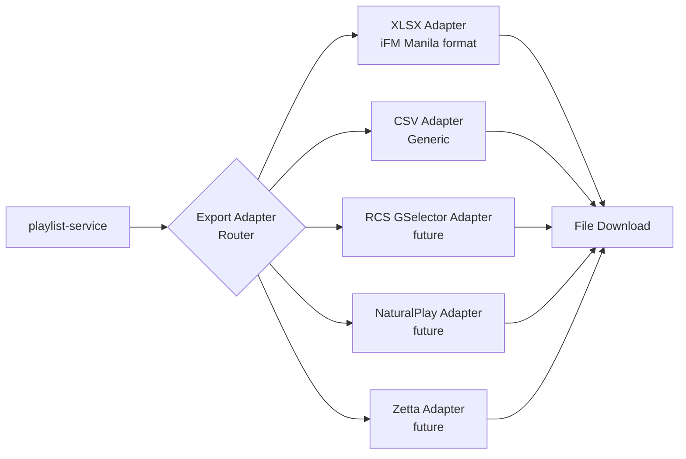
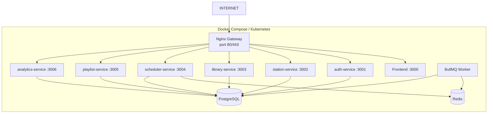

# PlayGen — System Architecture

## 1. High-Level System Diagram



---

## 2. Multi-Tenancy Model



---

## 3. Core Data Model (Entity Relationships)



---

## 4. Playlist Generation Flow



---

## 5. Cron-Based Auto Generation



---

## 6. Authentication & Authorization Flow



---

## 7. Export / Integration Architecture



Each adapter is a standalone module implementing a single `export(playlist): Buffer` interface. Adding a new broadcast system requires only a new adapter file — no changes to core services.

---

## 8. Deployment Topology (Target)



---

## 9. Storage Architecture (Cloudflare R2)

All persistent binary assets are stored in Cloudflare R2 via the `@playgen/storage` shared package.

| Service | Bucket | Prefix | Asset type |
|---|---|---|---|
| dj-service | `ownradio` | `dj-audio/` | TTS-generated MP3 segments |
| library-service | `ownradio` | `songs/` | Uploaded song files |
| dj-service | `ownradio` | `manifests/` | DJ show manifest JSON |

**`@playgen/storage` package** exports a common `IStorageAdapter` interface with `read`, `write`, `delete`, and `exists` methods. Two concrete adapters ship:
- `R2StorageAdapter` — S3-compatible, uses `@aws-sdk/client-s3` pointed at the R2 endpoint (`https://<ACCOUNT_ID>.r2.cloudflarestorage.com`). Configured via `R2_ACCOUNT_ID`, `R2_ACCESS_KEY_ID`, `R2_SECRET_ACCESS_KEY`, `R2_BUCKET_NAME`.
- `LocalStorageAdapter` — filesystem backed, used in local dev and unit tests.

The active adapter is selected at runtime from the `STORAGE_ADAPTER` env var (`r2` | `local`).

---

## 10. OwnRadio HLS Streaming Flow

PlayGen's DJ service is the audio source for ownradio.net's listener-facing radio player.

```
PlayGen DJ Service
  ├── playoutScheduler   — in-memory playout state, segment advance timer
  ├── hlsGenerator       — ffmpeg: R2 audio → local .ts segments + .m3u8
  └── streamRoutes       — GET /stream/:stationId/playlist.m3u8
           │
           │  (nginx gateway exposes /stream/* — PENDING Wire 1)
           ▼
PlayGen Station Service
  └── streamControlNotifier — POST ownradio webhook with new stream URL
           │
           ▼
OwnRadio API (ownradio.net)
  └── webhooks.ts — relays stream_control event via Socket.IO
           │
           ▼
OwnRadio Browser
  └── useStation hook → AudioControls (HLS.js) → plays playlist.m3u8
```

**Playout state machine:** `idle` → `generating` (ffmpeg running) → `live` (m3u8 ready, ownradio notified) → `ended` (cleanup).

**Three wires pending implementation** (see `docs/superpowers/specs/2026-04-23-ownradio-hls-streaming-design.md`):
1. **Wire 1** — `gateway/nginx.conf.template`: add `/stream/` location block proxying to DJ service port 3007, no auth, `proxy_buffering off`.
2. **Wire 2** — `services/dj/src/services/manifestService.ts`: after `buildProgramManifest` completes, call `startPlayout(stationId)` → `generateHls(stationId, manifest)` (background) → `notifyStreamUrlChange(slug, streamUrl)`.
3. **Wire 3** — R2-to-local cache constraint: `hlsGenerator.resolveAudioPath()` downloads all R2 audio before ffmpeg starts. Documented limit: `HLS_MAX_PREFETCH_MB` (default 500 MB). Segment-by-segment optimization deferred.

**Known constraints:** Single ffmpeg process per station; HLS segments are local to the DJ container (lost on restart); no DVR/time-shift.

**Environment variables required:**

| Service | Variable | Purpose |
|---|---|---|
| dj-service | `HLS_OUTPUT_PATH` | Local path for `.ts` segments + `.m3u8` |
| dj-service | `HLS_MAX_PREFETCH_MB` | Max R2 download before ffmpeg (default 500) |
| station-service | `OWNRADIO_WEBHOOK_URL` | Base URL for ownradio webhook (`https://ownradio.net`) |
| station-service | `PLAYGEN_WEBHOOK_SECRET` | Shared secret for webhook auth |

---

## 11. Info-Broker Audio Sourcing Integration

When a playlist is generated and songs have no `audio_url`, PlayGen calls the info-broker service to source audio from YouTube.

**Integration contract:**

```
POST https://<INFO_BROKER_URL>/v1/playlists/source-audio
Body: {
  "station_id": "uuid",
  "songs": [
    { "id": "uuid", "title": "Song Title", "artist": "Artist Name" }
  ],
  "callback_url": "https://api.playgen.site/api/v1/internal/audio-sourcing/callback"
}

Callback (POST from info-broker → PlayGen):
Body: {
  "station_id": "uuid",
  "results": [
    { "id": "uuid", "audio_url": "https://<R2_URL>/songs/<key>.mp3", "audio_source": "youtube" }
  ]
}
```

The info-broker: searches YouTube for each song, downloads, transcodes to MP3, uploads to the `ownradio` R2 bucket under the `songs/` prefix, then POSTs the callback URL with resolved `audio_url` values.

PlayGen playlist service (or scheduler service) handles the callback by writing `audio_url` and `audio_source` to the `songs` table rows.

**Status:** Integration design finalised 2026-04-23. Implementation pending — callback endpoint does not yet exist. See `tasks/todo.md` for the pending task.

---

## Design Decisions & Rationale

| Decision | Rationale |
|---|---|
| Stateless JWT auth | Services can scale horizontally without shared session state |
| BullMQ for generation | Playlist generation is CPU-bound; offloading prevents gateway timeouts |
| JSONB for rotation_rules | Rules vary per station; JSONB avoids schema migrations when rules change |
| JSONB for template day_of_week_overrides | MVP uses one template; JSONB future-proofs per-day-of-week templates without a new table |
| Per-company role definitions | Radio companies use different job titles; roles map internally to fixed permission sets |
| Company-level song sharing | Songs can be shared across stations within a company; future station-locking via `song_station_locks` table |
| Adapter pattern for exports | Broadcast system formats (RCS, Zetta, NaturalPlay) are proprietary; isolating them prevents coupling to core |
| Playlist immutability with override flag | Auto-generated entries can be re-run without losing manual changes (`is_manual_override = true` entries are preserved) |
| Cloudflare R2 for all binary assets | Single bucket (`ownradio`), prefixed by service; S3-compatible API via `@aws-sdk/client-s3`; avoids managing separate S3 credentials per service. `@playgen/storage` package provides an adapter interface so local and R2 adapters are swappable without changing service code. |
| HLS over direct Icecast for OwnRadio streaming | HLS.js works on all modern browsers without plugins; PlayGen already generates HLS via ffmpeg; allows serving from CDN/R2 in future. Icecast remains the live broadcast path for traditional radio hardware. |
| Info-broker callback pattern for audio sourcing | Async callback avoids holding open an HTTP connection during a potentially minutes-long YouTube download + transcode. PlayGen POSTs a `callback_url`; info-broker does work and POSTs back when done. |
